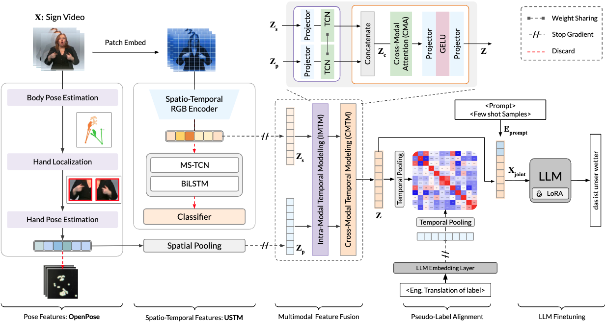

# ViPo-SLT: Large Vision Models with Spatio-Temporal Modules for Continuous Sign Language Recognition

## Abstract



Gloss-free Sign Language Translation (SLT) aims to directly translate sign language videos into spoken-language sentences without relying on glosses, which are standardized word-level labels of sign. Although SLT eliminates the need for gloss annotation, it remains challenging due to the need to capture fine-grained articulatory cues and align continuous visual input with natural language. Existing approaches often depend on single-modality representations or loosely fused multimodal features, which struggle to model the tight coordination between hand gestures, body motion, and facial expressions that underpin sign languages. To address these challenges, we propose ViPo-MLLM, a gloss-free SLT framework that explicitly integrates spatio-temporal RGB features with human pose representations. Our method employs dedicated encoders to extract complementary visual and pose-based features, followed by intra-modal temporal modeling and cross-modal temporal attention to capture both local dynamics and long-range cross-modal dependencies. The fused multimodal representation is conditioned with a structured prompt and fed to an LLM. The LLM is trained without gloss supervision using a combination of contrastive and language modeling objectives. Extensive experiments on the PHOENIX14T and CSL-Daily benchmarks demonstrate that the proposed framework achieves state-of-the-art performance among weakly supervised and fully gloss-free methods, while remaining competitive with gloss-based approaches. Ablation studies further highlight the complementary roles of pose and spatio-temporal visual cues and the effectiveness of cross-modal attention for gloss-free SLT.

| Dataset       | BLEU-4 | ROUGE-L |
| :------------ | :----: | :-----: |
| PHOENIX2014-T |  27.1  |  25.8   |
| CSL-Daily     |  51.5  |  54.5   |

## Data Preparation

These steps will be released soon...

## Setup Instructions

Follow these steps to set up the environment and get started:

1. **Clone the repository**:

   ```bash
   git clone https://github.com/gufranSabri/ViPo-SLT.git
   ```

2. **Set up the Python environment**:
   - Install `virtualenv`:

     ```bash
     pip install virtualenv
     ```

   - Create a virtual environment and activate it:

     ```bash
     python<version> -m venv vipo
     source vipo/bin/activate
     ```

   - Install the required dependencies:
     ```bash
     bash ./scripts/install.sh
     ```

### Training

To run our flagship model on the PHOENIX-14T dataset, you can use the following command:

```
python main.py --work-dir ./work_dir/p14t --config ./configs/baseline_edm.yaml
```

NOTE:

- If you are running an experiment on PHOENIX-14T on a SINGLE GPU, change `base_lr` to `0.0002` in `configs/baseline_edm.yaml` file.<br>
- If you are running an experiment on PHOENIX-14T on a TWO GPUs, change `base_lr` to `0.0001` in `configs/baseline_edm.yaml` file.<br>
- ie, the effective learning rate for the PHOENIX-14T dataset should be `0.0002`.
- For CSL-Daily, the effective learning rate should be `0.0001`.

### Infererence

For inference, run the command below:

```
python test.py --work-dir ./work_dir/p14t --config ./work_dir/p14t/baseline_edm.yaml
```

NOTE:

- Make sure to pass the correct config file; the file from the experiment directory.
